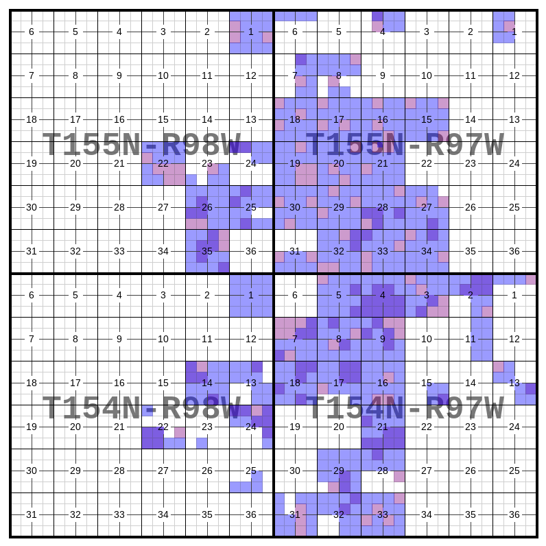

pyTRSplat
=========

pyTRSplat (imported as ``pytrsplat``) is a library for generating
customizable land plat images from Public Land Survey System (PLSS) land
descriptions (or “legal descriptions”).

Also check out the
`pyTRS library <https://github.com/JamesPImes/pyTRS>`_,
which handles parsing the land descriptions. You may want to reference the
`pyTRS quickstart guide <https://github.com/JamesPImes/pyTRS/blob/master/guides/guides/quickstart.md>`_
to see how the parsing works, and in particular the
`config parameters <https://github.com/JamesPImes/pyTRS/blob/master/guides/guides/quickstart.md#configuring-the-parser>`_.

Feel free to reach out via
`my GitHub <https://github.com/JamesPImes/pyTRSplat>`_
with feedback or inquiries, or to let me know if you run into any
issues.

Bird's-Eye View
---------------

.. code-block:: python

    import pytrsplat

To plat a single township, use a :doc:`Plat </modules/plat>`.

To plat multiple townships **on a single page**, use a
:doc:`MegaPlat </modules/megaplat>`.
*(The example image above is a MegaPlat.)*

To plat multiple townships, **each on its own page**, use a
:doc:`PlatGroup </modules/platgroup>`.

*(Example images are available in each link.)*

Table of Contents
-----------------

.. toctree::
    modules/quickstart

These classes are types of plats:

.. toctree::
    modules/plat
    modules/megaplat
    modules/platgroup

These classes contribute to the behavior and/or appearance of the plats.

.. toctree::
    modules/settings
    modules/lot_definer

These are custom warnings (subclasses of ``UserWarning``):

.. toctree::
    modules/warnings

This is a guide to using multiple layers:

.. toctree::
    modules/layers
