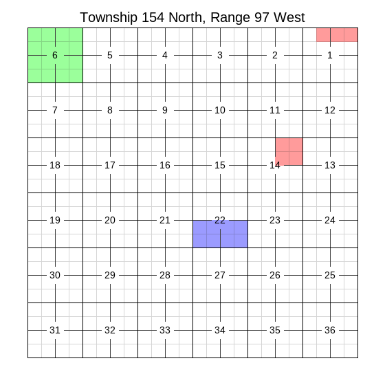

Using Multiple Layers
=====================

It is possible to write tracts to any platting class on different layers, optionally using a separate color for each.

Use the ``layer='some_layer'`` parameter when adding lands to a ``Plat``, ``PlatGroup``, or ``MegaPlat``, to specify which layer those lands belong to. This parameter exists in all methods for adding lands -- ``.add_description()``, ``.add_tracts()``, and ``.add_tract()``.

.. code-block:: python

    plat = pytrsplat.Plat()
    plat.add_description('T154N-R97W Sec 14: NE/4', layer='some_layer')
    plat.add_tracts(any_tractlist, layer='some_other_layer')
    plat.add_tract(any_tract, layer='some_third_layer')

And set the fill color for a given layer, with the ``.settings.set_layer_fill()`` method:

.. code-block:: python

    # ... Continuing the above block of code.

    plat.settings.set_layer_fill('some_layer', qq_fill_rgba=(255, 0, 0, 100))
    plat.settings.set_layer_fill('some_other_layer', qq_fill_rgba=(0, 255, 0, 100))
    plat.settings.set_layer_fill('some_third_layer', qq_fill_rgba=(0, 0, 255, 100))

Any unconfigured layers will fall back to ``.settings.qq_fill_rgba``.

Example Image
-------------

*(Resized from original output. Click to see full size.)*

Example Code
------------

This results in the image above.

.. code-block:: python

    import pytrsplat

    # Works the same with Plat, MegaPlat, or PlatGroup.
    plat = pytrsplat.Plat(settings=pytrsplat.Settings.preset('square_m'))
    plat.lot_definer.allow_defaults = True
    plat.lot_definer.standard_lot_size = 40

    # Add a couple descriptions to 'layer_1'.
    plat.add_description('T154N-R97W Sec 14: NE/4', layer='layer_1')
    plat.add_description('T154N-R97W Sec 1: Lots 1 - 3', layer='layer_1')
    # And another description to 'layer_2'.
    plat.add_description('T154N-R97W Sec 6: ALL', layer='layer_2')
    # Unspecified layer will use the default layer, called 'aliquot_fill'.
    plat.add_description('T154N-R97W Sec 22: S/2')

    RED = (255, 0, 0, 100)
    GREEN = (0, 255, 0, 100)
    plat.settings.set_layer_fill('layer_1', qq_fill_rgba=RED)
    plat.settings.set_layer_fill('layer_2', qq_fill_rgba=GREEN)

    plat.execute_queue()
    plat.output(fp=r"some/file/path.png")

Output layer order
------------------

By default, any layers added in this way will be merged in the order they were created (bottom-up). If needed, this can be overridden during ``.output()`` by specifying ``layers=<list of layer names>``. But in that case, you need to specify all other layers too. Reference ``Plat.DEFAULT_LAYER_NAMES`` for a list of the standard layer names.

.. code-block:: python

    # ... Continuing the above block of code.

    # This is also the order they get merged.
    desired_layers = [
        'background',
        'header',
        'footer',
        'aliquot_fill',
        'layer_1',  # Recommended that custom layers go after 'aliquot_fill'.
        'layer_2',
        'inner_lines',
        'sec_nums',
        'lot_nums',
        'sec_border',
        'twp_border',
    ]

    plat.output(fp=r"some/file/path.png", layers=desired_layers)

