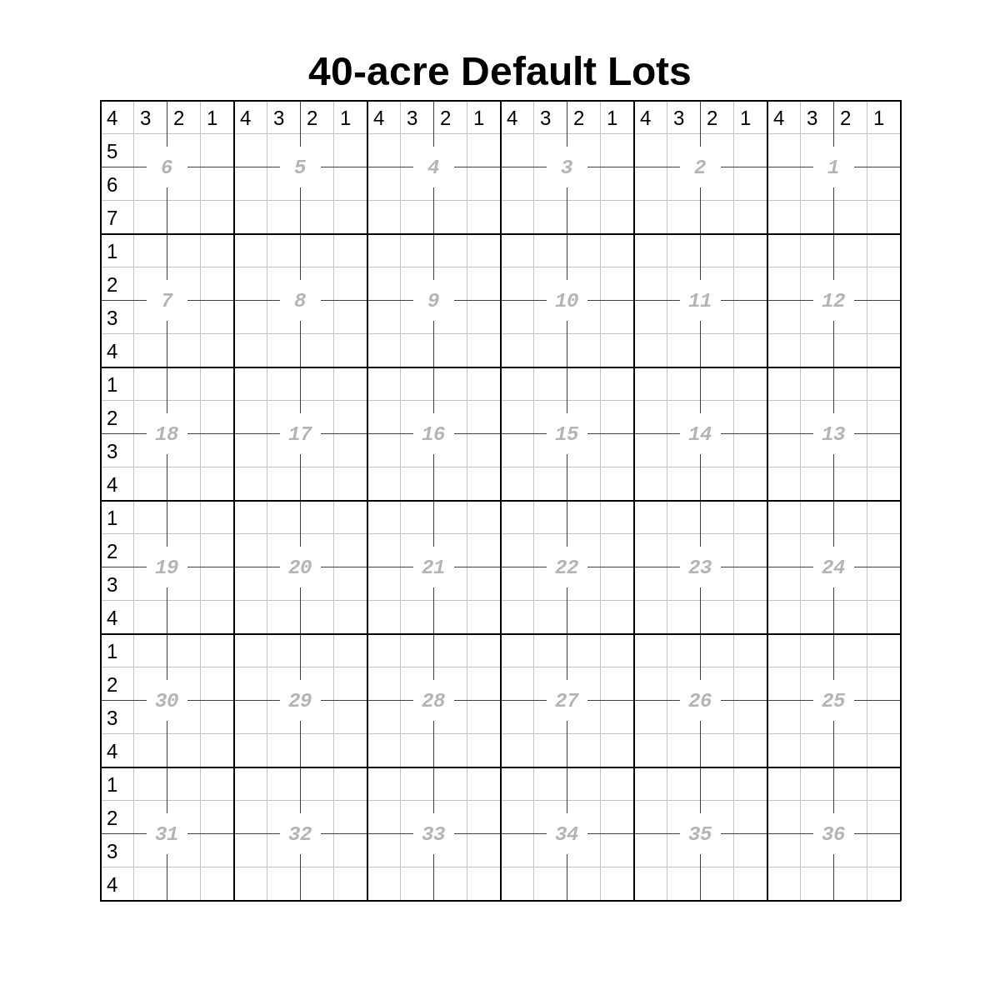
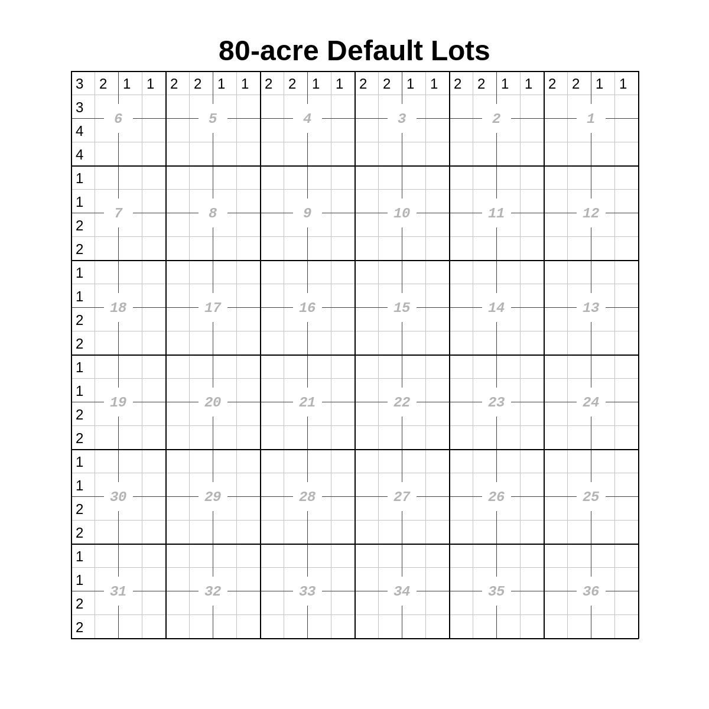

``LotDefiner``
==============

A ``LotDefiner`` is used to convert lots into aliquots.

A ``Plat``, ``PlatGroup``, and ``MegaPlat`` will have a ``LotDefiner``
in its ``.lot_definer`` attribute, which can be specified at init
(``lot_definer=<some LotDefiner object>``) and/or modified later.

.. code-block:: python

    import pytrsplat

    # Exclusively use defaults.
    default_lot_definer = pytrsplat.LotDefiner(
        allow_defaults=True,
        standard_lot_size=40
    )
    plat = pytrsplat.Plat(lot_definer=default_lot_definer)

    # Again use defaults.
    megaplat = pytrs.MegaPlat()
    megaplat.lot_definer.allow_defaults = True
    megaplat.lot_definer.standard_lot_size = 80

    # Use definitions that have been entered into a .csv file somewhere.
    better_lot_definer = pytrsplat.LotDefiner.from_csv(r'some/path/lotdef.csv')
    multipage_plat = pytrsplat.PlatGroup(lot_definer=better_lot_definer)
    # Can still allow defaults for sections that don't have definitions.
    multipage_plat.lot_definer.allow_defaults = True
    multipage_plat.lot_definer.standard_lot_size = 40

.. _default_lots:

Default lots
------------

In a 'typical' township, lots exist in the sections along the north and
west boundaries of the township -- i.e., Sections 1 - 7, 18, 19, 30, and
31.

Usually, these are roughly 40-acre lots (``.standard_lot_size = 40``),
but in some parts of the United States, they are approximately 80 acres
(``.standard_lot_size = 80``). Other layouts probably exist but are not
implemented in this library.

We can use ``allow_defaults = True`` to assume that the sections in the
queue are 'typical'.

Default lots, where ``.standard_lot_size = 40``:

Default lots, where ``.standard_lot_size = 80``:

.. _lot_defs_csv:

Defining lots in .csv
---------------------

The most efficient way to define lots is to add them to a .csv file and
load them into a ``LotDefiner`` with ``LotDefiner.from_csv()`` or later
with ``.read_csv()``.

.. code-block:: python

    import pytrsplat

    lot_definer = pytrsplat.LotDefiner.from_csv(r'some/path/lot_definitions.csv')
    # Keep the original definitions and add more of them from elsewhere.
    lot_definer.read_csv(r'other/path/more_definitions.csv')

Below is an example of appropriate .csv formatting:

+------+-----+-----+-----+-----------+
| twp  | rge | sec | lot | qq        |
+======+=====+=====+=====+===========+
| 154n | 97w | 1   | L1  | NENE      |
+------+-----+-----+-----+-----------+
| 12s  | 58e | 04  | 1   | N2NE,SENE |
+------+-----+-----+-----+-----------+

.. note::

    ``sec`` may optionally have a leading ``0`` (e.g., ``4`` or ``'04'``).

    ``lot`` may optionally have a leading ``L`` (e.g., ``1`` or
    ``'L1'``).

    ``qq`` can be one or more aliquots, separate by comma as needed.
    Be sure to use 'clean' QQ definitions, such as the above.

Defining lots in code
---------------------

.. code-block:: python

    import pytrsplat

    lot_definer = pytrsplat.LotDefiner()
    lot_definer.define_lot(
        trs='154n97w23',
        lot=1,
        definition='W2NE,NWSE'
    )

``trs`` must be in the standard pyTRS format, such as ``'154n97w01'`` or
``'2s58e24'``.

.. _prompt_define:

Defining lots manually in console
---------------------------------

When calling ``.execute_queue()`` on any plat-generating class, use parameter
``prompt_define=True`` to first check for undefined lots, and then prompt the
user in the console to define them individually.

.. code-block:: python

    import pytrsplat

    plat = pytrs.Plat(twp='154n', rge='97w')
    plat.add_description('T154N-R97W Sec 1: Lots 1 and 2')
    plat.execute_queue(prompt_define=True)  # Also works with `PlatGroup` and `MegaPlat`

Alternatively, if we want to prompt the user to define lots separately
from executing the queue, by calling ``.prompt_define()`` on a ``LotDefiner``
object, and passing to it the list of ``pytrs.Tract`` objects.

.. code-block:: python

    import pytrsplat

    some_list_of_tracts = pytrs.TractList()
    # <fill some_list_of_tracts with pytrs.Tract objects>
    # ...

    some_lot_definer = pytrsplat.LotDefiner()
    some_lot_definer.prompt_define(some_list_of_tracts)
    # <Do whatever we want with the lot definitions.>
    some_lot_definer.save_to_csv(r'some/path/manually_defined_lots.csv')

    # ...
    # And eventually, generate the plat.
    plat = pytrs.Plat(twp='154n', rge='97w', lot_definer=some_lot_definer)
    plat.add_tracts(some_list_of_tracts)
    plat.execute_queue()
    plat.output(fp=r"some/path/image.png")

Undefined Lots
--------------

When executing the queue in a ``Plat`` or other object, if a tract with
an undefined lot is encountered, a custom
:doc:`pytrsplat.UndefinedLotWarning <warnings>`
will be displayed, but no error will be raised.

To check the queue for undefined lots prior to executing the queue, call
``.find_undefined_lots()``.

.. code-block:: python

    import pytrsplat
    plat = pytrsplat.Plat()
    plat.add_description('T154N-R97W, Sec 9: Lot 1')

    # plat.execute_queue()  # Would show a warning of undefined lots: <154n97w09: L1>
    undefined_lots = plat.find_undefined_lots()
    print(undefined_lots)   # {'154n97w09': ['L1']}

Or simply use ``.execute_queue(prompt_define=True)``
as :ref:`mentioned above <prompt_define>`.

Methods and Attributes
----------------------

.. autoclass:: pytrsplat.LotDefiner
    :members:
    :special-members: __init__
