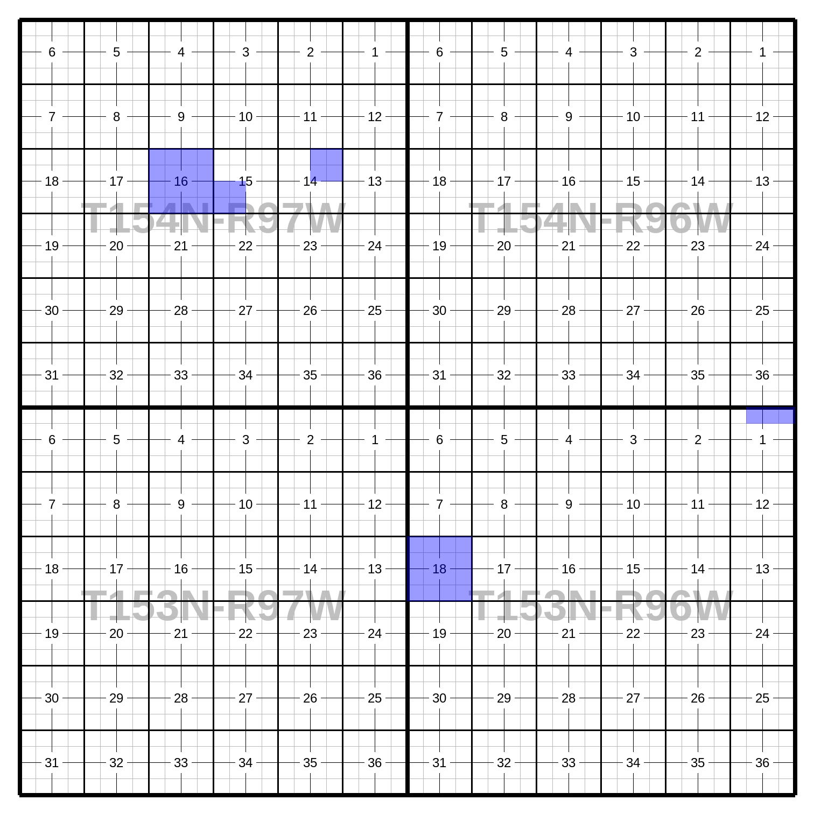

``MegaPlat``
============

Use this class to plat land across any number of townships, with all
townships appearing on the same page.

The three methods for adding lands to the ``MegaPlat`` are:

 - ``.add_description()``, for adding the full text of a land description.
 - ``.add_tract()``, for adding a ``pytrs.Tract`` (already parsed).
 - ``.add_tracts()``, for adding multiple ``pytrs.Tract`` objects (already parsed), such as ``pytrs.PLSSDesc`` or ``pytrs.TractList`` objects, which contain tracts.

See
:doc:`LotDefiner <lot_definer>`
for how to work with the ``.lot_definer`` attribute.

See
:doc:`Settings <settings>`
for how to work with the ``.settings`` attribute.

See :doc:`this discussion on working with multiple layers<layers>`
for using multiple colors for different tracts.

Example Image
-------------

*(Resized from original output. Click to see full size.)*

Example Code
------------

This results in the image above.

.. code-block:: python

    import pytrs
    import pytrsplat

    # Choose a settings preset.
    mp_preset = pytrsplat.Settings.preset('megaplat_default')
    # Adjust settings as desired.
    mp_preset.set_font('header', typeface='Sans-Serif (Bold)', size=80)

    megaplat = pytrsplat.MegaPlat(settings=mp_preset)
    # If we've written lot definitions to .csv, we load them here.
    megaplat.lot_definer.read_csv('some_lot_definitions.csv')
    # Otherwise / additionally, we can assume 'default' lots.
    megaplat.lot_definer.allow_defaults = True
    megaplat.lot_definer.standard_lot_size = 40

    # Add lands with `.add_description(), `.add_tract()`, or `.add_tracts()`.

    land_desc = """T154N-R97W
    Sec 14: NE/4
    T153N-R96W
    Sec 1: Lots 1 - 3
    Sec 18: ALL"""
    # `config` gets passed to pytrs for parsing.
    megaplat.add_description(
        land_desc,
        config='n,w'    # Optional, control parsing of description.
    )

    tract = pytrs.Tract(
        desc='SW/4',
        trs='154n97w15',
        parse_qq=True,  # parse_qq=True is REQUIRED
        config='n,w'    # Optional, control parsing of description.
    )
    megaplat.add_tract(tract)

    plss_desc = pytrs.PLSSDesc(
        'T154N-R97W Sec 16: ALL',
        parse_qq=True,  # parse_qq=True is REQUIRED
        config='n,w'    # Optional, control parsing of description.
    )
    megaplat.add_tracts(plss_desc)

    # Executing the queue will fill in the plat.
    megaplat.execute_queue()

    # Save to PNG.
    megaplat.output(fp=r'some\path\megaplat 153n96w-154n97w.png')
    # or to PDF (or nearly any other image format)
    megaplat.output(fp=r'some\path\megaplat 153n96w-154n97w.pdf')
    # or as PNG image inside a zip file.
    megaplat.output(fp=r'some\path\megaplat 153n96w-154n97w.zip', image_format='png')

Methods and Attributes
----------------------

.. autoclass:: pytrsplat.MegaPlat
    :members:
    :inherited-members:
    :special-members: __init__
