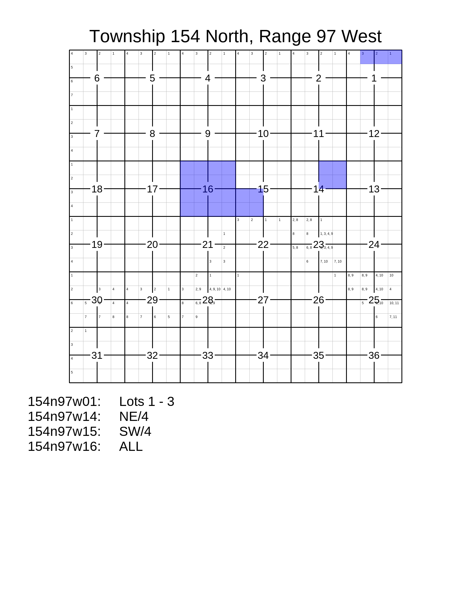

``Plat``
========

Use this class to plat land within a single Twp/Rge.

The three methods for adding lands to the ``Plat`` are:

 - ``.add_description()``, for adding the full text of a land description.
 - ``.add_tract()``, for adding a ``pytrs.Tract`` (already parsed).
 - ``.add_tracts()``, for adding multiple ``pytrs.Tract`` objects (already parsed), such as ``pytrs.PLSSDesc`` or ``pytrs.TractList`` objects, which contain tracts.

See
:doc:`LotDefiner <lot_definer>`
for how to work with the ``.lot_definer`` attribute.

See
:doc:`Settings <settings>`
for how to work with the ``.settings`` attribute.

.. note::

    A ``Plat`` accepts only one Twp/Rge, and if different Twp/Rges are
    encountered, it will raise a ``ValueError``. If you can't be sure
    that your description(s) will contain only a single Twp/Rge, you
    should consider using a ``PlatGroup`` or ``MegaPlat``, which allow
    multiple Twp/Rges.

Example Image
-------------

*(Resized from original output. Click to see full size.)*

Example Code
------------

This results in the image above.

.. code-block:: python

    import pytrs
    import pytrsplat

    # Choose a settings preset.
    letter_preset = pytrsplat.Settings.preset('letter')
    # Adjust settings as desired.
    letter_preset.set_font('footer', typeface='Sans-Serif', size=48)
    letter_preset.write_lot_numbers = True

    # If we don't set Twp/Rge here, it will be set when adding a tract.
    plat = pytrsplat.Plat(twp='154n', rge='97w', settings=letter_preset)
    # If we've written lot definitions to .csv, we load them here.
    plat.lot_definer.load_from_csv('some_lot_definitions.csv')
    # Otherwise / additionally, we can assume 'default' lots.
    plat.lot_definer.allow_defaults = True
    plat.lot_definer.standard_lot_size = 40

    # Add lands with `.add_description(), `.add_tract()`, or `.add_tracts()`.

    # `config` gets passed to pytrs for parsing.
    plat.add_description(
        "T154N-R97W Sec 1: Lots 1 - 3, Sec 14: NE/4",
        config='n,w'    # Optional, control parsing of description.
    )

    tract = pytrs.Tract(
        desc='SW/4',
        trs='154n97w15',
        parse_qq=True,  # parse_qq=True is REQUIRED
        config='n,w'    # Optional, control parsing of description.
    )
    plat.add_tract(tract)

    plss_desc = pytrs.PLSSDesc(
        'T154N-R97W Sec 16: ALL',
        parse_qq=True,  # parse_qq=True is REQUIRED
        config='n,w'    # Optional, control parsing of description.
    )
    plat.add_tracts(plss_desc)

    # Executing the queue will fill in the plat.
    plat.execute_queue()

    # Save to PNG.
    plat.output(fp=r'some\path\plat_154n97w.png')
    # or to PDF (or nearly any other image format).
    plat.output(fp=r'some\path\plat_154n97w.pdf')
    # or as a PNG inside a zip file.
    plat.output(fp=r'some\path\plat_154n97w.zip', image_format='png')

Methods and Attributes
______________________

.. autoclass:: pytrsplat.Plat
    :members:
    :inherited-members:
    :special-members: __init__
