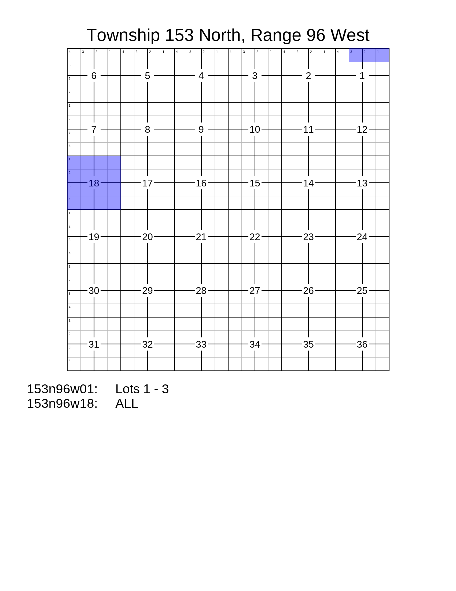
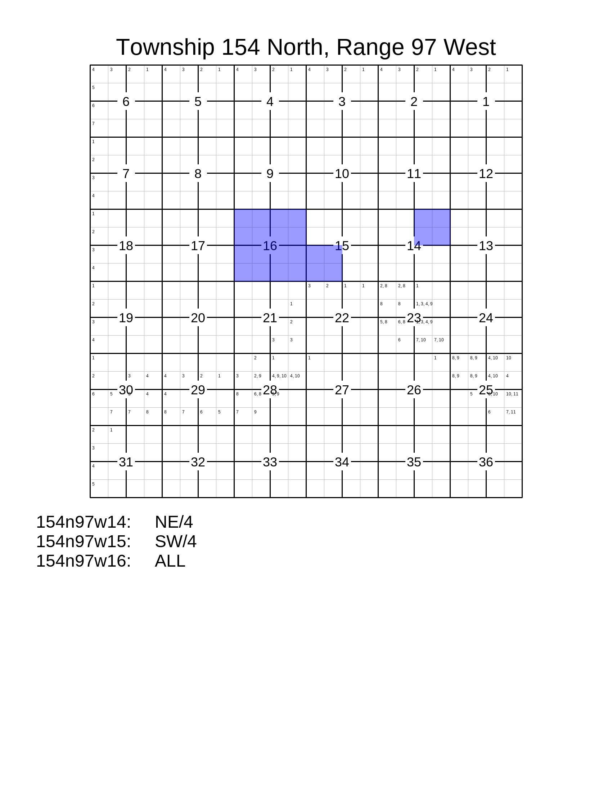

``PlatGroup``
=============

Use this class to plat land across any number of townships, with each
township on its own image / page. (But can optionally be saved to a
single PDF or TIFF file, with each plat on its own page.)

The three methods for adding lands to the ``PlatGroup`` are:
 * ``.add_description()``, for adding the text of a description directly.
 * ``.add_tract()``, for adding a ``pytrs.Tract`` (already parsed).
 * ``.add_tracts()``, for adding multiple ``pytrs.Tract`` objects (already parsed),
    such as ``pytrs.PLSSDesc`` or ``pytrs.TractList`` objects, which contain tracts.

See
:doc:`LotDefiner <lot_definer>`
for how to work with the ``.lot_definer`` attribute.

See
:doc:`Settings <settings>`
for how to work with the ``.settings`` attribute.

See :doc:`this discussion on working with multiple layers<layers>`
for using multiple colors for different tracts.

Example Images
--------------

*(Resized from original output. Click to see full size.)*

Page 1:

Page 2:

Example Code
------------

This results in the images above.

.. code-block:: python

    import pytrs
    import pytrsplat

    # Choose a settings preset.
    letter_preset = pytrsplat.Settings.preset('letter')
    # Adjust settings as desired.
    letter_preset.set_font('footer', typeface='Sans-Serif', size=48)
    letter_preset.write_lot_numbers = True

    multipage_plat = pytrsplat.PlatGroup(settings=letter_preset)
    # If we've written lot definitions to .csv, we load them here.
    multipage_plat.lot_definer.read_csv('some_lot_definitions.csv')
    # Otherwise / additionally, we can assume 'default' lots.
    multipage_plat.lot_definer.allow_defaults = True
    multipage_plat.lot_definer.standard_lot_size = 40

    # Add lands with `.add_description(), `.add_tract()`, or `.add_tracts()`.

    land_desc = """T154N-R97W
    Sec 14: NE/4
    T153N-R96W
    Sec 1: Lots 1 - 3
    Sec 18: ALL"""
    # `config` gets passed to pytrs for parsing.
    multipage_plat.add_description(
        land_desc,
        config='n,w'    # Optional, control parsing of description.
    )

    tract = pytrs.Tract(
        desc='SW/4',
        trs='154n97w15',
        parse_qq=True,  # parse_qq=True is REQUIRED
        config='n,w'    # Optional, control parsing of description.
    )
    multipage_plat.add_tract(tract)

    plss_desc = pytrs.PLSSDesc(
        'T154N-R97W Sec 16: ALL',
        parse_qq=True,  # parse_qq=True is REQUIRED
        config='n,w'    # Optional, control parsing of description.
    )
    multipage_plat.add_tracts(plss_desc)

    # Executing the queue will fill in the plats.
    multipage_plat.execute_queue()

    # Save to PNG. In this case, one PNG for each page.
    multipage_plat.output(fp=r'some\path\platgroup.png')
    # Saving to PDF or TIFF allows all pages to be included in the same file.
    multipage_plat.output(fp=r'some\path\platgroup_153n96w,154n97w.pdf')
    # Or save as multiple PNG images (or other format) inside a ZIP file.
    multipage_plat.output(fp=r'some\path\platgroup.zip', image_format='png')

Methods and Attributes
----------------------

.. autoclass:: pytrsplat.PlatGroup
    :members:
    :inherited-members:
    :special-members: __init__
