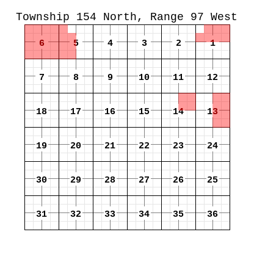
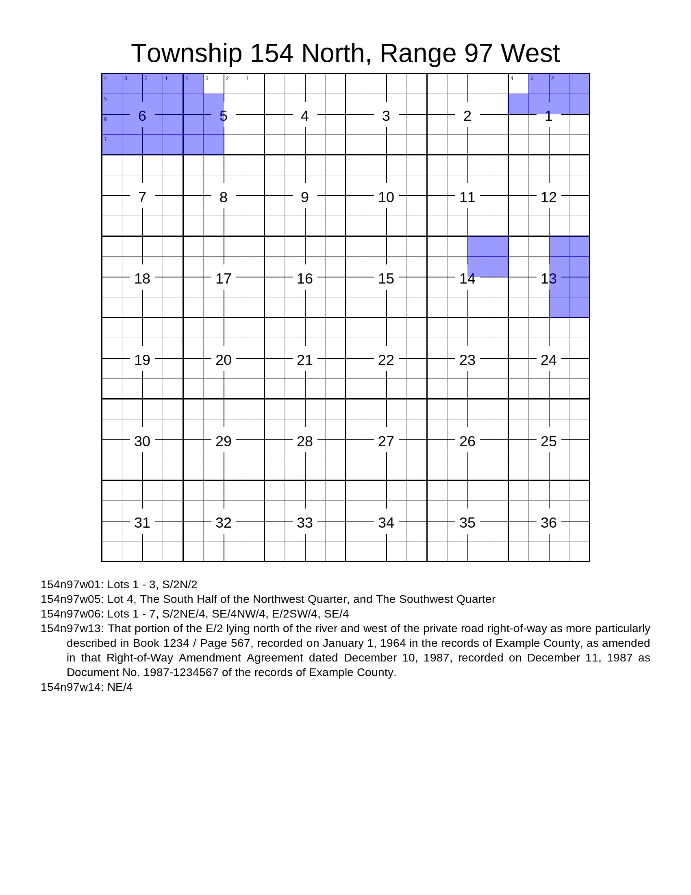
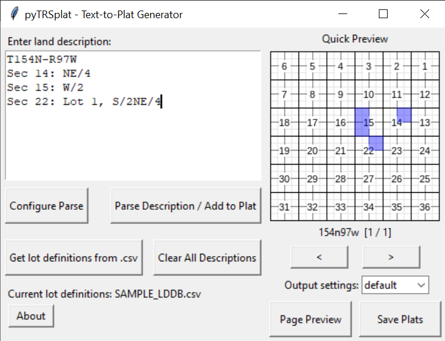
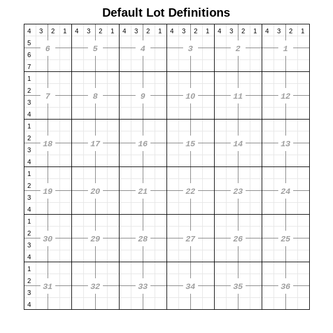

# pyTRSplat

A python module (imported as `pytrsplat`) and application for generating customizable plat images of PLSS descriptions (or 'legal descriptions') of land. Uses the [pyTRS library](https://github.com/JamesPImes/pyTRS) for parsing raw land descriptions into their component parts and the [Pillow (PIL) library](https://python-pillow.org/) for drawing the plats. (And also a small role for the [piltextbox module](https://github.com/JamesPImes/piltextbox), which was spun off from this project.)

## To install

...from the GitHub repo.
```
$ pip install -r https://raw.githubusercontent.com/JamesPImes/pyTRSplat/master/requirements.txt

$ pip install git+https://github.com/JamesPImes/pyTRSplat@master
```

(Cleaner install options coming soon.)


## Sample Outputs

Processing the following example PLSS land description...
```
Township 154 North, Range 97 West
Section 1: Lots 1 - 3, S/2N/2
Section 5: Lot 4, The South Half of the Northwest Quarter, and The Southwest Quarter
Section 6: Lots 1 - 7, S/2NE/4, SE/4NW/4, E/2SW/4, SE/4
Section 13: That portion of the E/2 lying north of the river and west of the private road right-of-way as more particularly described in Book 1234 / Page 567, recorded on January 1, 1964 in the records of Example County, as amended in that Right-of-Way Amendment Agreement dated December 10, 1987, recorded on December 11, 1987 as Document No. 1987-1234567 of the records of Example County.
Section 14: NE/4
```
...results in the following square plat (using one custom setting):



...or the following letter-sized plat, with tracts written at the end (using a different setting):



...or could be configured any number of ways for different sizes, fonts, colors, page size/shape, etc.


## Included GUI Application

A full-featured GUI application is included as `pyTRSplat_app_windowed.pyw`. The interface is a little rough-around-the-edges (especially the custom settings editor), but it has nearly all of the features of the module.

Lands can be added either by entering their PLSS description as raw text, or by manually selecting which QQ's to fill -- or both methods. It currently will save to PNG or PDF.



## Quick demonstration of pyTRSplat as a module

The sample code block below is a demonstration of the basic functionality of converting text into a plat. See the next section of this readme for more fine-grained explanations.

```
import pytrsplat

# The raw text of the PLSS description for the land we want to plat.

land_description = '''Township 154 North, Range 97 West
Section 1: Lots 1 - 3, S/2N/2
Section 5: Lot 4, The South Half of the Northwest Quarter, and The Southwest Quarter
Section 6: Lots 1 - 7, S/2NE/4, SE/4NW/4, E/2SW/4, SE/4
Section 13: That portion of the E/2 lying north of the river and west of the private road right-of-way as more particularly described in Book 1234 / Page 567, recorded on January 1, 1964 in the records of Example County, as amended in that Right-of-Way Amendment Agreement dated December 10, 1987, recorded on December 11, 1987 as Document No. 1987-1234567 of the records of Example County.
Section 14: NE/4'''


# This .csv file is included in the pytrsplat\_examples\ directory. It
# defines what lot 1 means in Section 22, T154N-R97W (and other
# lots/sections).
lot_database_fp = r'pytrsplat\_examples\SAMPLE_LDDB.csv'

# Will output to a .png file (could also output to .pdf)
output_fp = r'C:\land plats\sample_plat_01.png'

# Using the 'letter' settings preset (i.e. letter-sized paper at 200ppi),
# generate the plat, and save as .png to the specified filepath
plats = pytrsplat.text_to_plats(
    land_description, settings='letter', lddb=lot_database_fp,
    output_filepath=output_fp)

# `plats` is a list of PIL.Image.Image objects
print(type(plats[0]))  # prints "<class 'PIL.Image.Image'>"


# Optionally customize the plat output by creating a Settings object
set_obj = pytrsplat.Settings(preset='letter')
set_obj.write_header = False  # Disable writing of header
set_obj.qq_side = 12  # 12px per side of each QQ square

# ... Or use the GUI Settings customizer in `SettingsEditor.py` to create,
# edit, and save presets

# Will output to a .pdf file
output_fp_2 = r'C:\land plats\sample_plat_01.png'

plats_2 = pytrsplat.text_to_plats(
    land_description, settings=set_obj, lddb=lot_database_fp,
    output_filepath=output_fp_2)
```


## Overview of primary module classes and functions

[`pytrsplat.launch_app()`](https://github.com/JamesPImes/pyTRSplat#included-gui-application) -- Launch the GUI application discussed above. (Or run `pyTRSplat_app_windowed.pyw` directly.)

[`pytrsplat.text_to_plats()`](https://github.com/JamesPImes/pyTRSplat#quickly-generate-plats-from-raw-land-descriptions-with-text_to_plats) -- A function to generate plat images directly from raw PLSS land descriptions

[`pytrsplat.Plat` and `pytrsplat.MultiPlat` objects](https://github.com/JamesPImes/pyTRSplat#get-more-control-with-plat-and-multiplat-objects) -- Generate plat images, optionally incorporating multiple data sources, custom header, etc. (Generate plats directly from raw text with the `MultiPlat.from_unparsed_text()` method.)

[`pytrsplat.PlatQueue` and `pytrsplat.MultiPlatQueue` objects](https://github.com/JamesPImes/pyTRSplat#easily-handle-multiple-data-sources-with-platqueue-and-multiplatqueue-objects) -- Streamline platting from multiple sources.

[`pytrsplat.Settings` objects](https://github.com/JamesPImes/pyTRSplat#configure-the-output-with-settings-objects-including-presets-and-custom-settings) -- Configure the output styling and behavior of `Plat` and `MultiPlat` objects, including the `pytrsplat.text_to_plats()` function.

[`pytrsplat.LotDefDB`, `pytrsplat.TwpLotDefinitions`, and `pytrsplat.LotDefinitions` objects](https://github.com/JamesPImes/pyTRSplat#objects-for-explicit-lot-defintions----lotdefinitions-twplotdefinitions-and-lotdefdb) -- Define how lots should be interpreted.
* *__(See especially [loading lot definitions from .csv files](https://github.com/JamesPImes/pyTRSplat#loading-lot-definitions-data-from-csv-files-for-use-in-multiplat-and-plat-objects) for the easiest way to define lots.)__*
* *(See also ["Why do we need lot definitions, anyway?"](https://github.com/JamesPImes/pyTRSplat#why-do-we-need-lot-definitions-anyway))*

['Default lots' and the `allow_ld_defaults=<bool>` parameter](https://github.com/JamesPImes/pyTRSplat#default-lots-and-the-allow_ld_defaultsbool-parameter) -- Whether to define lots as though it is a 'standard' township (when lots have not been explicitly defined otherwise).

[`SectionGrid` and `TownshipGrid` objects](https://github.com/JamesPImes/pyTRSplat#manual-platting-with-sectiongrid-and-townshipgrid-objects-and-other-methods) -- These primarily function as behind-the-scenes interpretors/translators for converting objects from the `pytrs` module into data that is useful for this module, but could also be used for platting manually-selected lands.


### Quickly generate plats from raw land descriptions with `text_to_plats()`
This convenience function is the simplest way to generate plats, other than the GUI application. It takes as input a raw PLSS land description (optionally using `pytrs` config parameters for configuring how it should be parsed), and returns flattened PIL.Image objects of the generated plats, optionally saving them to filepath as .png or .pdf files.
Example:
```
import pytrsplat

land_description = 'T154N-R97W, Sec 14: NE/4, Sec 15: W/2'

# Using the 'letter' preset (i.e. 8.5"x11" paper at 200ppi, etc.), generate plat
# and save to the specified filepath; returns a list containing a single plat (because
# there was only one Twp/Rge in the land description)
plats = pytrsplat.text_to_plats(
    land_description, settings='letter', output_filepath=r'C:\Land\Plats\example_plat.png')

# print to console the type of the first element in the list `plats`:
print(type(plats[0]))  # prints '<class 'PIL.Image.Image'>'
```


### Get more control with `Plat` and `MultiPlat` objects
For generating more nuanced or complicated plats, or incorporating data from multiple sources, these are the objects to use.
`pytrsplat.Plat` -- A single plat, comprising a single PLSS township of land. (Can also plat a single section. See `pytrsplat.Plat` documentation on `only_section=<int>` parameter.)

`pytrsplat.MultiPlat` -- A collection of any number of plats (i.e. `pytrsplat.Plat` objects, stored as a list in the `.plats` attribute), all sharing identical settings and general parameters, and each comprising a single PLSS township of land. These can also handle `pytrs.PLSSDesc` objects, whereas `Plat` objects cannot (because `PLSSDesc` objects can span multiple Twp/Rge).


#### `Plat` example
```
import pytrsplat

# Create a Plat with the 'legal' preset (i.e. 8.5x14" paper at 200ppi, etc.);
# will show a grid of all 36 sections, with the header 'Township 154 North, Range 97 West'
# but with no specific lands projected onto it yet.
plat_1 = pytrsplat.Plat(twp='154n', rge='97w', settings='legal')

# We'll import pytrs, a module for parsing land descriptions (which this module builds on)
import pytrs

# Creating a tract, being the NE/4 of Section 14, T154N-R97W
tract_1 = pytrs.Tract(desc='NE/4', trs='154n97w14')

# Parsing it into lots/QQs; not bothering with any optional `config=` parameters here.
tract_1.parse()

# Project the parsed `tract_1` onto our plat, which will now show the NE/4 of Section 14
# colored in, and '154n97w14: NE/4' written below the grid.
plat_1.plat_tract(tract_1)

# Flatten and save the plat to this filepath:
plat_1.output(r'C:/Land/Plats/sample_01.png')
```


#### `MultiPlat` example
```
import pytrsplat

# Create a MultiPlat with the 'legal' preset (i.e. 8.5x14" paper at 200ppi, etc.).
# No Plats will be created at init, but any that do get created later will use the same
# 'legal' preset.
multiplat_1 = pytrsplat.MultiPlat(settings='legal')

# We'll import pytrs, a module for parsing land descriptions (which this module builds on)
import pytrs

# Creating a PLSSDesc object, spanning lands in T154N-R97W and T155N-R97W
sample_text = 'T154N-R97W Sec 14: SE/4, Sec 15: W/2, T155N-R97W Sec 22: S/2'
plssdesc_1 = pytrs.PLSSDesc(sample_text)

# Parse `plssdesc_1` it into pytrs.Tract objects, which get parsed into lots/QQs by virtue
# of the parameter init_parse_qq=True (see pyTRS docs for more info); also not bothering with
# any optional `config=` parameters here.
plssdesc_1.parse(init_parse_qq=True)

# `plssdesc_1` now has 3 Tracts in `.parsedTracts` attribute, being in 154n97w14, 154n97w15,
# and 155n97w22 (i.e. there are two unique Twp/Rges: 154n97w and 154n98w).

# Process the parsed `plssdesc_1` onto our MultiPlat, which will now create two Plat objects,
# one for T154N-R97W and another for T155N-R97W, each with the appropriate lands colored in,
# and the corresponding tracts written at the bottom (which can be enabled or disabled in
# a Settings object)
multiplat_1.plat_plssdesc(plssdesc_1)

# Can access either of the generated Plat objects, which are stored in `.plats` attribute:
plat_154n97w = multiplat_1.plats[0]
plat_155n97w = multiplat_1.plats[1]

# Flatten and save both of the generated Plats to a PDF the this filepath:
multiplat_1.output_to_pdf(r'C:/Land/Plats/sample_01.pdf')
```


### Easily handle multiple data sources with `PlatQueue` and `MultiPlatQueue` objects

These objects can streamline generating `Plat` and `MultiPlat` objects with data from multiple sources:

* `pytrsplat.PlatQueue` -- A list (with additional functionality) of objects that can be projected onto a single `Plat` with the `Plat.process_queue()` or `Plat.from_queue()` methods.

* `pytrsplat.MultiPlatQueue` -- A dict, keyed by Twp/Rge (e.g., `'154n97w'` or `'1s7e'`) of `PlatQueue` objects applicable to the respective Twp/Rge. This object can be sorted and automatically processed into the appropriate `Plat` object in a `MultiPlat` with the `MultiPlat.process_queue()` or `MultiPlat.from_queue()` methods.

#### (some example data sources to queue up)
```
# First, create some example pytrs.Tract and pytrs.PLSSDesc objects

import pytrs

# Creating a couple tracts, and parsing them into lots/QQs with the pyTRS module
tract_1 = pytrs.Tract(desc='NE/4', trs='154n97w14')
tract_1.parse()
tract_2 = pytrs.Tract(desc='W/2NW/4', trs='154n97w13')
tract_2.parse()

# Creating a couple PLSSDesc objects, spanning lands in T154N-R97W, T155N-R97W, T156N-R97W
sample_text_1 = 'T154N-R97W Sec 14: SE/4, Sec 15: W/2, T155N-R97W Sec 22: S/2'
plssdesc_1 = pytrs.PLSSDesc(sample_text_1)
sample_text_2 = 'T154N-R97W Sec 11: S/2SE/4, T156N-R97W Sec 36: S/2S/2'
plssdesc_2 = pytrs.PLSSDesc(sample_text_2)

# parsing them into pytrs.Tract objects, which get parsed into lots/QQs by virtue of the
# parameter init_parse_qq=True (see pyTRS docs for more info)
plssdesc_1.parse(init_parse_qq=True)
plssdesc_2.parse(init_parse_qq=True)

```
#### `PlatQueue` example
```
# (using the example pyTRS objects from the above block of sample code)

import pytrsplat

pq1 = pytrsplat.PlatQueue()

# Both `tract_1` and `tract_2` can be added to the same PlatQueue object, because
# they represent lands in the same Twp/Rge. (It would not raise an error if they
# were different Twp/Rge, because PlatQueue objects are agnostic to Twp/Rge, but the
# resulting plats would be inaccurate.)
pq1.queue_add(tract_1)
pq1.queue_add(tract_2)

# Create a Plat and process the contents of `pq1`:

plat_1 = pytrsplat.Plat(settings='letter')
plat_1.process_queue(pq1)

# plat_1 has now colored in the lands in `tract_1` and `tract_2`, and written their text
# below the grid (because that feature is enabled in the 'letter' preset)

# NOTE: PLSSDesc objects cannot be added to a PlatQueue, and it would raise an error if we
# tried. This is because a PLSS description can span multiple Twp/Rge's, whereas a single
# Plat can only depict one Twp/Rge.

```
#### `MultiPlatQueue` example
```
# (using the example pyTRS objects from the above block of sample code)

# Unlike with PlatQueue objects, pytrs.PLSSDesc objects can be added to a MultiPlatQueue object,
# which does allow multiple Twp/Rge's.
# (a MultiPlatQueue object is NOT agnostic to Twp/Rge, and in fact Twp/Rge serves as its dict
# keys -- ex: '154n97w' or '1s7e' etc.)

mpq1 = pytrsplat.MultiPlatQueue()

# Add to `mpq1` our two PLSSDesc objects, and the subordinate pytrs.Tract objects are
# automatically sorted by Twp/Rge and added to the appropriate PlatQueue within `mpq1`
mpq1.queue_add(plssdesc_1)
mpq1.queue_add(plssdesc_2)

mpq1['154n97w']  # returns a PlatQueue object containing the pytrs.Tract objects in T154N-R97W
mpq1['155n97w']  # Does the same, for T155N-R97W
mpq1['156n97w']  # Does the same, for T156N-R97W
#mpq1['157n97w']  # This would raise a KeyError, because there were no tracts in T157N-R97W

# We can also add the two pytrs.Tract objects to the MultiPlatQueue, if we want. Specifying
# the `twprge` (i.e. the appropriate dict key for these objects) here is optional, because
# the MultiPlatQueue can deduce it from the Tract objects' own `.twp` and `.rge` attributes.
# However, specifying `twprge` is good practice, because the pyTRS parsing algorithm is not
# infallible and could have misread the Twp/Rge (or maybe `twp` / `rge` were not specified when
# the Tract objects were initialized).
mpq1.queue_add(tract_1, twprge='154n97w')
mpq1.queue_add(tract_2, twprge='154n97w')


multiplat_1 = pytrsplat.MultiPlat(settings='letter')
multiplat_1.process_queue(mpq1)

# `multiplat_1` has now generated three plats (for T154N-R97W, T155N-R97W, and T156N-R97W), with
# the lands colored in and tract text written, each using the 'letter' preset.

```

Note that specifying `twprge` when adding a `pytrs.PLSSDesc` via `MultiPlatQueue.queue_add()` has no effect. Because PLSS descriptions can have multiple Twp/Rge's, `MultiPlatQueue` objects mandate pulling the the Twp/Rge(s) from the `.twp` and `.rge` attributes of the `pytrs.Tract` objects listed in the `.parsedTracts` attribute of the `PLSSDesc` object.

Note also that `pytrsplat.SectionGrid` and `pytrsplat.TownshipGrid` objects can also be added to `PlatQueue` and `MultiPlatQueue` objects (for MPQ's, requiring `twprge` to be specified when added), but those objects


#### `MultiPlatQueue.queue_add_text()` method example
```
# This...

import pytrs
import pytrsplat

sample_text_3 = 'T154N-R97W Sec 1: Lots 1 - 3, S/2N/2'
plssdesc_3 = pytrs.PLSSDesc(sample_text, config='clean_qq')
plssdesc_3.parse()
mpq2 = pytrsplat.MultiPlatQueue()
mpq2.queue_add(plssdesc_3)


# ... is functionally equivalent to this:

import pytrsplat

mpq2 = pytrsplat.MultiPlatQueue()
sample_text_3 = 'T154N-R97W Sec 1: Lots 1 - 3, S/2N/2'
mpq2.queue_add_text(sample_text_3, config='clean_qq')


# i.e. `.queue_add_text()` takes raw text of a PLSS land description, parses it (taking the
# same optional pyTRS `config=` parameters), and adds the results to the MultiPlatQueue

```


### Configure the output with `Settings` objects, including presets and custom settings

`pytrsplat.Settings` -- Configure the look and behavior of Plat and MultiPlat objects (e.g., size, colors, fonts, whether to write headers/tracts/etc.). Default and presets are available and customizable.

Wherever a `settings=` parameter appears within this module, it can take either the name of a preset (a string, ex: `'letter'`, `'legal (gray)'`, `'square_m'`, etc.) or as a `pytrsplat.Settings` object.


```
import pytrsplat

# Using the 'square_m' preset...
plat_1 = pytrsplat.Plat(twp='154n', rge='97w', setting='square_m')


# Or generate a custom settings object, starting from the 'letter' preset...
custom_setting_1 = pytrsplat.Settings('letter')
# ...disable writing the header:
custom_setting_1.write_header = False
# ...and change the font for writing section numbers, to 'Mono' (a Courier-like font):
custom_setting_1.set_font('sec', Settings.TYPEFACES['Mono'])

# Now create a Plat using this custom setting:
plat_2 = Plat(twp='154n', rge='97w', setting=custom_setting_1)
```


*__Note:__ To see a current list of available `Settings` presets, call `pytrsplat.Settings.list_presets()`*

*__Note:__ For a GUI application for viewing / editing / saving `Settings` presets, call `pytrsplat.launch_settings_editor()`*

*[__#TODO:__ List out all `Settings` attributes, and what they control. They can all be set with the `.launch_settings_editor()`, of course, but should provide a guide to setting them programatically.]*


### Getting into the weeds with 'lot definitions' -- `LotDefinitions`, `TwpLotDefinitions`, and `LotDefDB` objects; and the `allow_ld_defaults=<bool>` parameter
The most efficient way to define lots is to do so externally in a .csv file, and load them into a `pytrsplat.LotDefDB` with init parameter `from_csv=<filepath>`. (See below.) __[#TODO: Link to that part of the readme]__

Before talking about explicit lot definitions (i.e. `LotDefinitions`, `TwpLotDefinitions`, and `LotDefDB` objects), we'll talk about 'default' lot definitions, i.e. the 'expected' lots in a standard township.


#### Why do we need lot definitions, anyway?

Quarter-quarters (QQs) are not ambiguous (i.e. the NE/4NE/4 or `'NENE'` is always in the same place in any section\*\*). However, by design of the PLSS, lots can occur anywhere within a section (which is the point of using lots instead of QQs in the first place -- to account for variations in the land). So we need some method for interpreting the lots in terms of QQs (e.g., in a 'typical' Section 1, Lot 1 is equivalent to the NE/4NE/4).

\*\* *Caveat: Non-standard sections with out-of-place QQs do exist but are relatively rare in most parts of the United States. In any case, such sections cannot be handled reliably by the current version of this module.*


#### 'Default Lots' and the `allow_ld_defaults=<bool>` parameter

In a 'standard' township, where land features, bodies of water, mountains, etc. do not overly complicate the survey, lots are predictably situated along the northern and western boundaries -- i.e. in Sections 1 - 7, 18, 19, 30, and 31. That is what is meant by `'default lots'` in this module (depicted below):



In practice, non-standard townships are common even in flat parts of the United States, and so these default lot definitions cannot be blindly relied upon with too much confidence. However, defining lots for every plat could become onerous, and so they are included as a backup option (which is always disabled by default). Wherever the parameter `allow_ld_defaults=True` is passed in this module, these defaults will be used *__unless the user has explicitly defined lots for a given section__* (in which case the explicit lot defintions will control).


##### (Create a few `pytrs.Tract` objects to use in examples)
```
import pytrs

# Section 1, T154N-R97W has only standard lots -- i.e. Lots 1, 2, 3, and 4 correspond to
# the NENE, NWNE, NENW, and NWNW respectively (by design of a 'standard' township)

tract_1 = pytrs.Tract(desc='Lots 1 - 4, S/2N/2', trs='154n97w01')
tract_1.parse()


# Section 25 of the same township has non-standard lots, due to a river that runs through it

tract_2 = pytrs.Tract(desc='Lots 5, 8', trs='154n97w25')
tract_2.parse()
```


##### What happens when lots are undefined in a `Plat`:
```
# (An example plat with intentionally undefined lots, using the above example pytrs.Tract objects)

# parameter `allow_ld_defaults=False` isn't needed, since that's the default, but to be explicit
# for this example:
plat_1 = pytrsplat.Plat(allow_ld_defaults=False)
plat_1.plat_tract(tract_1)
plat_1.plat_tract(tract_2)

# `plat_1` now shows the S/2N/2 of Section 1 as filled, but none of the lots in either section,
# because the module was not told how to interpret those lots. (The full tract text of both Tract
# objects is written at the bottom, however.)

# a Plat object's `.unhandled_lots_by_sec` attribute is a dict (keyed by section number) that shows
# lots that the user attempted to plat but were undefined and therefore couldn't be placed
print(plat_1.unhandled_lots_by_sec)  # prints "{1: ['L1', 'L2', 'L3', 'L4'], 25: ['L5', 'L8']}"
```


##### Allowing default lots with `allow_ld_defaults=True` when initializing `Plat` or `MultiPlat` objects
```
# (An example plat allowing default lots, but with other lots undefined. Again using the above
# example pytrs.Tract objects.)

# This time passing parameter `allow_ld_defaults=True` when initializing our Plat.
plat_2 = pytrsplat.Plat(allow_ld_defaults=True)
plat_2.plat_tract(tract_1)
plat_2.plat_tract(tract_2)

# `plat_2` now shows the entire N/2 of Section 1 as filled, because default lot definitions dictate
# that Lots 1 - 4 of any Section 1 are equivalent to the N/2N/2. However, no lands in Section 25 are
# filled, because no Section 25 ever has any default lots, and we haven't explicitly defined Lots 5
# or 8.

print(plat_2.unhandled_lots_by_sec)  # prints "{1: [], 25: ['L5', 'L8']}"
```


##### Allowing default lots with `allow_ld_defaults=True` *__AFTER__* initializing `Plat` or `MultiPlat` objects
```
# (Another example plat allowing default lots, but with other lots undefined. Again using the
# above example pytrs.Tract objects.)

# Again being explicit with `allow_ld_defaults=False` for example purposes.
plat_3 = pytrsplat.Plat(allow_ld_defaults=False)

# When platting individual objects or processing PlatQueue objects, we have the opportunity to again
# specify whether to `allow_ld_defaults=<bool>` (and now it defaults to what is set in the Plat object)
plat_3.plat_tract(tract_1, allow_ld_defaults=True)

# We can specify `allow_ld_defaults=True` here, but it will have no effect, because no Section 25 ever
# has default lots.
plat_3.plat_tract(tract_2, allow_ld_defaults=True)

print(plat_3.unhandled_lots_by_sec)  # prints "{1: [], 25: ['L5', 'L8']}"
```

To plat Lots 5 and 8 of Section 25, T154N-R97W, we have to explicitly define those lots -- most easily by loading from a .csv file of lot definition data. *[__#TODO__: Link to that part of the readme.]*


##### IMPORTANT: Conflicts between default lot definitions and explicit lot definitions

When parameter `allow_ld_defaults=True` is passed, but the user has also explicitly defined lots for a given section (via `pytrsplat.LotDefDB` object or otherwise), the default lots will NOT be used -- even if those default lots were not included in the explicit definitions.

For example, if we __do__ explicitly define Lots 5 - 8 in a hypothetical Section 1, but __do not__ also explicitly define Lots 1 - 4 of that section, then default lots 1 - 4 will not be picked up, even if we pass `allow_ld_defaults=True`.

This example demonstrated:

```
# A hypothetical example plat, where `allow_ld_defaults=True` will have no effect due to
# explicit lot definitions


# Example pytrs.Tract object
import pytrs
tract_3 = pytrs.Tract(desc='Lots 1 - 8', trs='155n97w01')
tract_3.parse()


import pytrsplat

# Create a LotDefDB object from a .csv file, where Lots 5 - 8 of Section 1, T155N-R97W
# are defined as the SWNW, SENW, SWNE, SENE, respectively -- but no other lots are
# defined for Section 1 (i.e. NOT the 'expected' Lots 1 - 4 in the N/2N/2).
# (Lots 5 - 8 do not actually exist for that section and are only used as an example.)
lddb_obj = pytrsplat.LotDefDB(from_csv=r'C:\land\lddb data\some_hypothetical_file.csv')

# Now create a Plat, passing our LotDefDB object to parameter `tld=` (which pulls the
# appropriate lot definitions from the LDDB, since we've specified Twp/Rge).
# We will also explicitly allow default lots.
plat_4 = pytrsplat.Plat(twp='155n', rge='97w', tld=lddb_obj, allow_ld_defaults=True)

plat_4.plat_tract(tract_3)


# Lots 5 - 8 have been platted (i.e. the S/2N/2), but Lots 1 - 4 are NOT filled, even
# though they are default lots, because by design, the Plat won't accept default lots
# in a section for which EXPLICIT lot definitions exist.
print(plat_4.unhandled_lots_by_sec)  # prints "{1: ['L1', 'L2', 'L3', 'L4']}"

# We would have to also explicitly define Lots 1 - 4 for this section in the .csv file.
```

This limitation is intentional: If a user explicitly defines lots for a section, then (a) it is most likely to be a non-standard section (where Lot 1 may not correspond with the *expected* QQ), and (b) it should be easy enough for the user to just define every lot in that section.


##### Final thoughts on `allow_ld_defaults=` parameter

The above examples are not the only places where the `allow_ld_defaults=` parameter appears. It's found in essentially all methods, functions, and objects where lot definitions may require definitions (either requiring them immediately or expecting to at some later time).


#### Objects for explicit lot defintions -- `LotDefinitions`, `TwpLotDefinitions`, and `LotDefDB`

In this module, lots get defined in a hierarchical structure of specialized `dict` objects:
```
-- pytrsplat.LotDefDB - dict, keyed by Twp/Rge (str), value-type:
---- pytrsplat.TwpLotDefinitions - dict, keyed by sec number (int), value-type:
------ pytrsplat.LotDefinitions - dict, keyed by lot name (ex: 'L2'), value-type:
-------- a string, being the name of one or more QQ's, separated by comma (ex: 'L2' -> 'NWNE')
```

Thus, rudimentary access in a `LotDefDB` object called `lddb_obj` might be `lddb_obj['154n97w'][1]['L2']` (using Python's built-in bracket syntax), perhaps resulting in `'NWNE'` (i.e. Lot 2, of Sec 1, T154N-R97W corresponds with the NW/4NE/4 of that section). *(See `pytrsplat.LotDefDB` docs for specific getter methods that are designed to avoid key errors and handle defaults more robustly than Python's built-in `dict` methods/syntax.)*

However, the end user probably doesn't have much cause to directly access the contents of a `LotDefDB`, `TwpLotDefinitions` or `LotDefinitions` object. I suspect most users will only need to pass such objects as parameters for methods in `Plat` or `MultiPlat` objects, or potentially `SectionGrid` / `TownshipGrid` objects.

*__[#TODO:__ Table for which objects / methods can take which lot definition types, and for which parameters.]*


##### Loading lot definitions data from .csv files (for use in `MultiPlat` and `Plat` objects)

It's easiest to define lots externally in a .csv file, and load them into the appropriate object for this module -- either with `LotDefDB(from_csv=<filepath>)` or `TwpLotDefinitions.from_csv(<filepath>, twp=<>, rge=<>)`.

Below are the simplest options for loading lot definitions for this module. More complication options are available (discussed in the documentation), but understanding these should be sufficient for most use cases.


###### Defining lots for a `MultiPlat` object by loading from .csv file:
```
import pytrsplat

# This .csv file is included in the 'pytrsplat\_examples\' directory. (May need to provide
# an absolute path, depending on where this code is being run.)
lddb_filepath = r'_examples\SAMPLE_LDDB.csv'

# Load the data from the .csv file into a LotDefDB object
lddb_obj_1 = pytrsplat.LotDefDB(from_csv=lddb_filepath)

# pass the `lddb_obj_1` to the `lddb=` init parameter of a MultiPlat object
multiplat_1 = pytrsplat.MultiPlat(settings='letter', lddb=lddb_obj_1)


```

###### Defining lots for a `Plat` object by loading from .csv file:
```
import pytrsplat

# This .csv file is included in the 'pytrsplat\_examples\' directory. (May need to provide
# an absolute path, depending on where this code is being run.)
lddb_filepath = r'_examples\SAMPLE_LDDB.csv'


# There are three options for Plat objects:


# Option A -- TwpLotDefinitions.from_csv() method
# 1) Load the data from the .csv file directly into a TwpLotDefinitions object
# (specifying Twp/Rge is mandatory)
tld_obj_1 = pytrsplat.TwpLotDefinitions.from_csv(lddb_filepath, twp='154n', rge='97w)

# 2) Pass the `tld_obj_1` to the `tld=` init parameter of a Plat object
# (specifying Twp/Rge is optional, but won't write the appropriate header without it)
plat_1 = pytrsplat.Plat(settings='letter', tld=tld_obj_1, twp='154n', rge='97w')


# Option B -- LotDefDB.get_tld() method
# 1) Load the data from the .csv file into a LotDefDB object
lddb_obj_2 = pytrsplat.LotDefDB(from_csv=lddb_filepath)

# 2) Use the `.get_tld()` method on the LotDefDB object, by specifying the `twprge`
# (which is a dict key). It would return and store `None` if '154n97w' were not an
# existing key in `lddb_obj_2`. (There are optional parameters for that possibility,
# which are covered in the documentation.)
tld_obj_2 = lddb_obj_1.get_tld('154n97w')

# 3) Pass the `tld_obj_2` to the `tld=` init parameter of a Plat object
# (specifying Twp/Rge is optional, but won't write the appropriate header without it)
plat_2 = pytrsplat.Plat(settings='letter', tld=tld_obj_2, twp='154n', rge='97w')


# Option C -- Passing a LotDefDB to a Plat directly
# 1) Load the data from the .csv file into a LotDefDB object
lddb_obj_3 = pytrsplat.LotDefDB(from_csv=lddb_filepath)

# 2) pass the `lddb_obj_1` to the `tld=` init parameter of a Plat object;
# IMPORTANT: to use this option, we MUST specify Twp/Rge, or it won't know which
# `twprge` key to use on the LotDefDB object.
plat_3 = pytrsplat.Plat(settings='letter', tld=lddb_obj_3, twp='154n', rge='97w')
```


###### Formatting a .csv file for lot definitions

Take a look at the example `SAMPLE_LDDB.csv` that is included in the `'pytrsplat\_examples\'` directory. And follow these formatting guidelines for creating .csv files that are compatible with this module:
1) These 5 headers MUST exist, all lowercase, no quotation marks: `twp`, `rge`, `sec`, `lot`, `qq`
2) twp must be specified in the format '000x' (up to 3 digits, plus N/S specified as a single, lowercase character 'n' or 's').
ex: `154n` for Township 154 North; `7s` for Township 7 South
3) rge must be specified in the format '000x' (up to 3 digits, plus E/W specified as a single, lowercase character 'e' or 'w').
ex: `97w` for Range 97 West; `6e` for Range 6 East
4) `sec` and `lot` should specified as simple integers (non-numeric lots cannot currently be handled)
5) `qq` should be in the format as follows:
    a) `NENE` for 'Northeast Quarter of the Northeast Quarter';
       `W2` for 'West Half'; `ALL` for 'ALL' ... (These get passed through `pytrs` parsing, so reasonable abbreviations SHOULD be captured...)
    b) If a lot comprises more than a single QQ, separate QQs by comma (with no space), and/or use larger aliquot divisions as appropriate.
        ex: Lot 1 that comprises the N/2NE/4 could be specified under the 'qq' columns as `N2NE`
        ex: Lot 4 that sprawls across the E/2NW/4 and SW/4NW/4 could be specified under the 'qq' column as `E2NW,SWNW`
6) Any other columns (e.g., `COMMENTS`) should be acceptable but will be ignored.
7) Duplicate lot entries will result in only the last-entered row being effective. If a lot comprises multiple QQ's, keep it on a single row, and refer to list item #5 above on how to handle it.
8) Keep in mind that extremely long .csv files might conceivably take a while to process and/or result in a LotDefDB that burdens the system's memory.


### Manual platting with `SectionGrid` and `TownshipGrid` objects, and other methods.

These objects are mostly beyond the scope of a quick-start guide, except to point you in the right direction:
* `pytrsplat.TownshipGrid` -- A grid representing an entire township (i.e. a 6x6 grid of sections; and storing a `SectionGrid` object for each section)

* `pytrsplat.SectionGrid` -- A grid representing a section (i.e. a 4x4 grid of quarter-quarters, or 'QQs')

Look into the respective documentation on these objects for how to manipulate / access their data. (Notably, when platting `pytrs.Tract` and `pytrs.PLSSDesc` objects, that data gets translated into these object types behind the scenes.)

Note that `TownshipGrid` and `SectionGrid` objects can be added to `PlatQueue` and `MultiPlatQueue` objects with `.queue_add()`; and both can be platted directly onto a `Plat` object with `.plat_township_grid()` and `.plat_sec_grid()`, respectively. (But to process them into a `MultiPlat` object, they must be added to a `MultiPlatObject`, which will be processed instead).

Also, for the simplest option for manual platting, look into the `Plat.fill_qq()` method, which does not use much logic beyond using the designated color to fill in the square at the designated grid coordinate for the designated section.


### Misc. functions / utilities:

These functions are also beyond the scope of a quick-start guide, and why they might be useful:
* `pytrsplat.filter_tracts_by_twprge()` -- Filter a list of `pytrs.Tract` objects into a dict, keyed by Twp/Rge
* `pytrsplat.tracts_into_twp_grids()` -- Apply the parsed data in a list of `pytrs.Tract` objects into a dict of TownshipGrid objects (keyed by Twp/Rge)
* `pytrsplat.plssdesc_to_twp_grids()` -- Apply the parsed data in a `pytrs.PLSSDesc` object into a dict of TownshipGrid objects (keyed by Twp/Rge)

I expect few users would have cause to use these functions without an already deep understanding of the whole module (so probably nobody).

