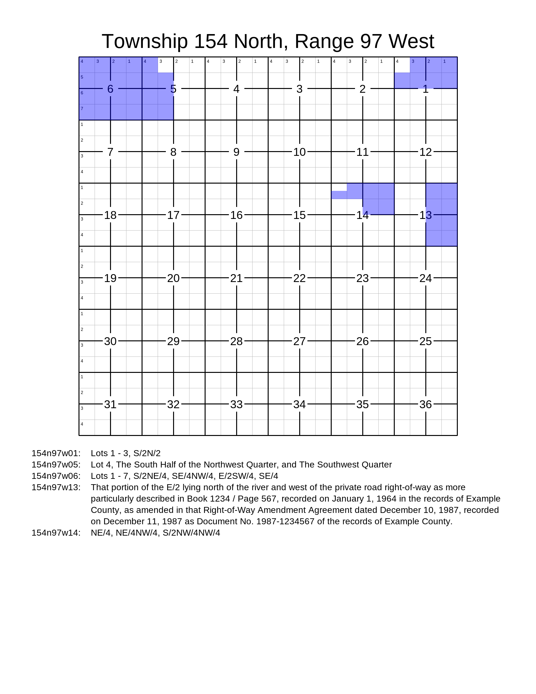

# pyTRSplat

Imported as `pytrsplat`, this Python library is an extension of the
[pyTRS library](https://github.com/JamesPImes/pyTRS)
that generates customizable plats from
[Public Land Survey System (PLSS)](https://en.wikipedia.org/wiki/Public_Land_Survey_System)
land descriptions (or "legal descriptions").


## To install

Directly from the GitHub repo:

```
pip install git+https://github.com/JamesPImes/pyTRSplat
```


## Requires

Python 3.9 or newer


## Quickstart Guide and Docs

A quickstart guide is provided
[here](https://pytrsplat.readthedocs.io/en/latest/modules/quickstart.html).

Documentation is provided
on [ReadTheDocs](https://pytrsplat.readthedocs.io/).


## Sample Outputs

Processing the following example PLSS land description...

```
Township 154 North, Range 97 West
Section 1: Lots 1 - 3, S/2N/2
Section 5: Lot 4, The South Half of the Northwest Quarter, and The Southwest Quarter
Section 6: Lots 1 - 7, S/2NE/4, SE/4NW/4, E/2SW/4, SE/4
Section 13: That portion of the E/2 lying north of the river and west of the private road right-of-way as more particularly described in Book 1234 / Page 567, recorded on January 1, 1964 in the records of Example County, as amended in that Right-of-Way Amendment Agreement dated December 10, 1987, recorded on December 11, 1987 as Document No. 1987-1234567 of the records of Example County.
Section 14: NE/4, NE/4NW/4, S/2NW/4NW/4
```

...results in the following square plat:


...or the following letter-sized page, with tracts written at the end (click for full size):



...or could be configured any number of ways for different sizes, fonts, colors, page size/shape, etc.


## Desktop Application

See [release v0.4.2](https://github.com/JamesPImes/pyTRSplat/tree/v0.4.2) for the desktop application.

*(No longer maintained as part of this library; removed as of v0.5.0.)*


## Demonstration

The following code generates the letter-size plat shown in the examples
above. It assumes that there are 'standard' approximately 40-acre lots
in the sections along the north and west boundaries of the township.

```
import pytrsplat

land_description = '''Township 154 North, Range 97 West
Section 1: Lots 1 - 3, S/2N/2
Section 5: Lot 4, The South Half of the Northwest Quarter, and The Southwest Quarter
Section 6: Lots 1 - 7, S/2NE/4, SE/4NW/4, E/2SW/4, SE/4
Section 13: That portion of the E/2 lying north of the river and west of the private road right-of-way as more particularly described in Book 1234 / Page 567, recorded on January 1, 1964 in the records of Example County, as amended in that Right-of-Way Amendment Agreement dated December 10, 1987, recorded on December 11, 1987 as Document No. 1987-1234567 of the records of Example County.
Section 14: NE/4, NE/4NW/4, S/2NW/4NW/4'''

plat_group = pytrsplat.PlatGroup()
plat_group.settings = pytrsplat.Settings.preset('letter')
plat_group.lot_definer.allow_defaults = True
plat_group.lot_definer.standard_lot_size = 40
# `config` gets passed along to the pytrs library.
plat_group.add_description(land_description, config='n,w')
plat_group.execute_queue()
plat_group.output(fp=r'C:\land plats\sample_plats.zip', filetype='png')
```

If there were multiple townships in our plat group, we could put the
resulting plats in a single PDF:

```
# `stack=True` tells the output to add them all to the same image file.
plat_group.output(fp=r'C:\land plats\sample_plats.PDF', stack=True)
```
